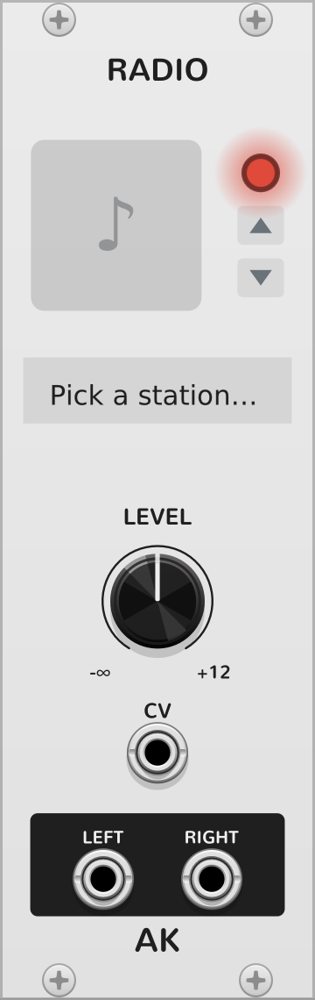
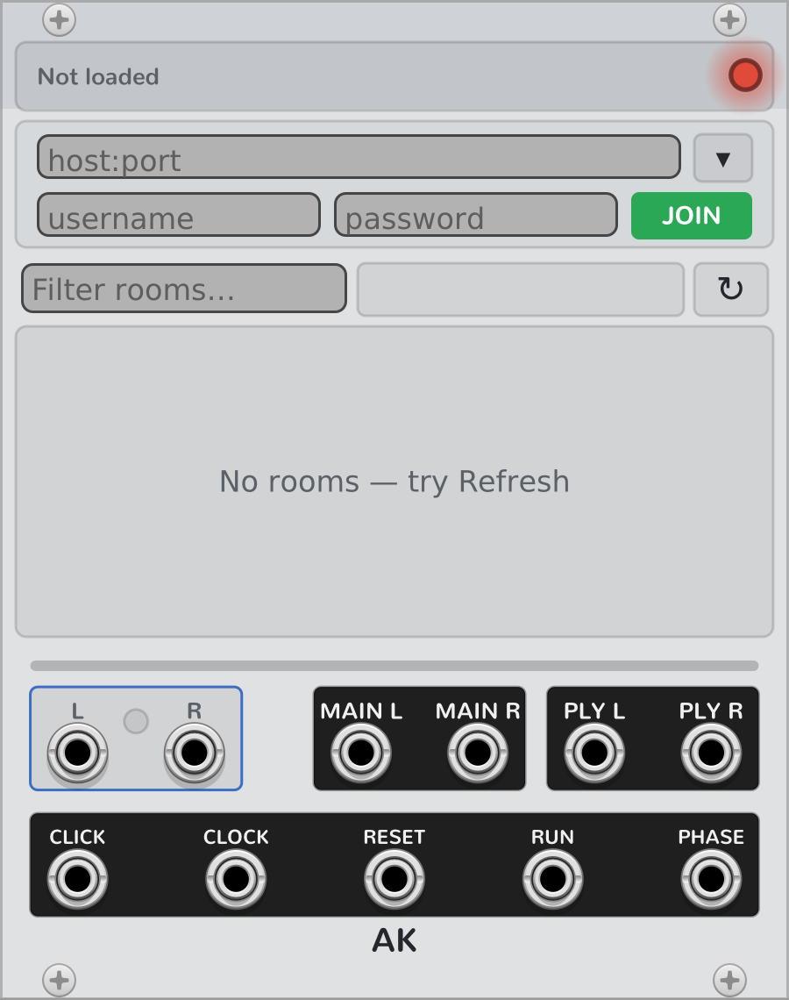

# AK Audio

My personal VCV Rack plugin: a few modules that get network audio in and out of Rack.
Internet radio, NINJAM jamming, a looper that follows the jam, and a recorder that
turns the whole thing into an Ableton Live set afterwards. They all share the same
networking code in `src/net/` (streaming, decoding, and a lock-free ring buffer that
feeds the audio thread).

This README is the overview. The details — panel references, how-tos,
troubleshooting — are in [docs/MANUAL.md](docs/MANUAL.md).

## Modules

> **A warning:** Radio and Ninjam are the much simpler modules, and are supposed to be
> bug-free. **Looper and Recorder are new and much more complex** — a realtime loop
> engine, multi-threaded capture, on-disk sessions, and a DAW-project exporter. Please
> consider them as **beta**: expect the occasional rough edge or bug, especially in
> corner cases. Please report anything odd via GitHub issues.

### Radio



Internet radio in a patch. Give it a stream URL (MP3, AAC, or HLS) and it plays,
decoded on a background thread, with a level knob on the way out. It comes with a
bunch of stations I like — ambient, spoken word, radio scanners — and you can paste in
your own URL: the module checks that audio actually plays, looks up the station's
name, grabs its icon, and only then saves it as a preset.

### Ninjam



A NINJAM client. Two modes: **LISTEN** just plays a room's public stream and sends
nothing anywhere; **JOIN** speaks the actual NINJAM protocol — you hear everyone's
live mix and your own instruments go out to the room, interval by interval, the same
way the official client does it. There's a room browser right on the panel, room
chat, and a voice mode for talking between takes.

### Looper


An 8×8 looper that runs on the jam's clock (it's a Ninjam expander; on its own it
uses a simulated clock). Everything is quantized to the beat: press an empty cell and
recording starts on the next beat; press it again and the take ends there — any whole
number of beats, up to one interval. Loops play back at whatever speed they were
recorded at, and if the room changes tempo they just keep going — nothing gets
re-pitched. What you play right before the starting beat folds into the end of the
loop, so pickups survive. Play through the end of an interval and the recording rolls
into the next cell down and chains; launch the first cell and the whole performance
replays.

Cells have repeats, decay, and follow actions. There are scenes, an overdub latch,
and track names sync with a MindMeld MixMaster. Every take is written to disk and
comes back with the patch.

How I use it: as an insert on the MixMaster, with poly cables — insert send into
INS, OUTS back into the return — so each mixer channel gets its own looper track.
And if you're going to export to Ableton Live **Lite**, stay within **6** instrument
channels: the export needs tracks 7 and 8 for the bounced players and the TX mix.

*Beta — see the warning above.*

### Recorder


Records the jam. It sits next to Ninjam and, while armed, writes every player's
intervals (and your own transmitted mix) to disk as the raw OGG bytes — no
re-encoding, nothing thrown away. When you stop recording, it builds an Ableton Live
set out of the whole session: the looper grid as Session clips, what-played-when on
each track's Arrangement lane, everyone's audio on the timeline, tempo set. A menu
choice targets full Live (a track per player) or Live Lite (everything fitted into
its 8-track cap).

*Beta — see the warning above.*

## Building

You need either the official Rack SDK at `../Rack-SDK` (run `tools/get_sdk.sh` to
fetch it) or a Rack source build at `../Rack` — the Makefile finds whichever is
there (`make RACK_DIR=/path/to/Rack-SDK` to override).

```bash
tools/get_sdk.sh   # one-time: download the Rack SDK for your OS/arch into ../Rack-SDK
make               # -> plugin.dylib / plugin.so / plugin.dll
make install       # package + install into the Rack user plugins folder
make clean
```

On Windows, build under MSYS2/MINGW64 via `tools/install_win.ps1` from PowerShell —
it builds and installs into `%LOCALAPPDATA%\Rack2` (`-BuildOnly` skips the install,
and it refuses to install while Rack is running).

## Adding a module

1. Add `src/<Name>.cpp` (Module + ModuleWidget + `Model* model<Name> = createModel<...>("<Name>")`).
2. Declare `extern Model* model<Name>;` in `src/plugin.hpp`.
3. Register it with `p->addModel(model<Name>);` in `src/plugin.cpp`.
4. Add a `res/<Name>.svg` panel and a module entry in `plugin.json`.

## Privacy

AK Audio makes network connections **only when you ask it to**, and only to the
servers needed to play or share what you choose. There is **no telemetry, no
analytics, no tracking, and no account** — nothing is collected, and nothing leaves
your machine except the connections listed below, only while a module is active.

**Incoming only** (the plugin receives audio; it sends nothing but the request):

- **Radio / Ninjam (LISTEN)** — connects to the stream URL you pick (or a bundled
  station preset) and plays its audio.
- **Add a station from a URL** — looks the URL up on
  [radio-browser.info](https://www.radio-browser.info) to get the station's real
  name, then downloads its icon from the station's own server. The icon is cached as
  a file in your Rack user folder; nothing about you is uploaded.
- **Room browser** — fetches the public list of NINJAM rooms from ninbot.com **only
  when you open the list** (hit Refresh, click into it, or type in the filter).
  Just adding a Ninjam module, or opening a patch that contains one, never contacts
  ninbot on its own.

**Outgoing — this sends your audio and text to a server and other people:**

- **Ninjam (JOIN)** — connects to the NINJAM server you choose (anonymous login) and
  **transmits the audio on the module's input jacks** so other people in the room can
  hear it, in real time. Chat messages you send go to the same server. Only use JOIN
  when you intend to be heard; LISTEN never transmits. Transmitting is always an
  explicit choice you make each session — loading a patch never starts broadcasting
  on its own, even if the patch was saved while transmitting.

**Your credentials stay on your machine.** A NINJAM server login (username and
password) is saved only in a local file in your Rack user folder (owner-readable
only), **never written into a saved patch** — sharing a `.vcv` never leaks your
password or the list of servers you've joined. Registered-server passwords are
protected on the wire by NINJAM's challenge-response, but the NINJAM protocol itself
is unencrypted, so treat room chat and audio as public, and don't reuse a valuable
password on a NINJAM server.

Stream and server connections use TLS when the server offers it, but server
certificates are **not currently verified** (`SSL_VERIFY_NONE`) — a deliberate choice
that's fine for public audio and jamming (no passwords travel over these
connections), and not fine for anything sensitive. Redirects to private/internal
addresses and TLS-stripping downgrades are refused.

## License

Copyright © 2026 Andrei Kozlov.

AK Audio is free software: you can redistribute it and/or modify it under the
terms of the GNU General Public License as published by the Free Software
Foundation, either version 3 of the License, or (at your option) any later
version. See [LICENSE](LICENSE) for the full text.

Bundled third-party code retains its own (GPL-compatible) license:
libogg / libvorbis (BSD), stb_vorbis and dr_mp3 (public domain), and FAAD2
(GPL-2.0-or-later; compiled in on Windows and Linux for AAC/HLS decoding — macOS
uses the system AudioToolbox instead).
