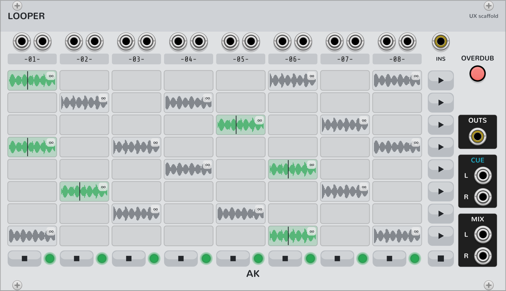
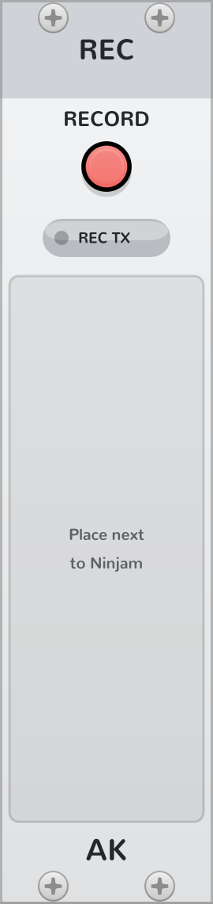
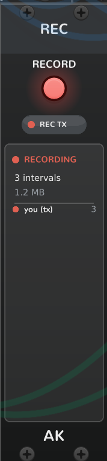

# AK Audio — Manual

AK Audio is a collection of "network audio → Rack" modules by Andrei Kozlov. Every
connection is something *you* start; nothing is sent from your machine unless a module
explicitly transmits (only Ninjam's JOIN does). See the
[Privacy section of the README](../README.md#privacy) for details.

- [Radio](#radio) — streaming internet radio into a patch.
- [Ninjam](#ninjam) — listen to, or jam in, a NINJAM room.
- [Looper](#looper) — 8×8 beat-quantized looper on the jam's clock.
- [Recorder](#recorder) — archive the jam; export it as an Ableton Live set.
- [Troubleshooting](#troubleshooting) — what the panel error messages mean.

---

## Radio

A streaming internet-radio source. Point it at an Icecast/HTTP stream and it decodes the
audio and feeds it into your patch through a built-in level control.

### Panel

| Control | What it does |
|---|---|
| **LEVEL** knob | Built-in VCA. VCV AUDIO taper, from −∞ up to +12 dB. The ring around the knob shows the current gain. |
| **CV** input | Optional unipolar 0–10 V control over the level (scales the knob). |
| **▲ / ▼** stepper | Step through all stations (bundled + your own), deduplicated by URL. |
| **Station display** | Click to open the grouped station picker (thumbnails; the current station has a green ring). |
| **L / R** outputs | Stereo audio out. |
| **LED** | Lit only when audio is actually decoding and flowing — not merely "connected." |

### Playing a station

1. Click the station display to open the picker, or use ▲/▼ to cycle.
2. Pick a station; it connects and starts playing. The chosen station is saved with the
   patch and auto-resumes on load.

Stations are ordinary Rack **presets** — you'll also find them under right-click →
*Preset*, and under the *Stations* submenu in the context menu.

### Adding your own station

1. Right-click the module → paste a stream URL into the **Add station from URL** field.
2. The module *auditions* it off-thread: it confirms real audio is flowing (not just that
   the host answered), looks the URL up on radio-browser to get the real station name and
   icon, and caches the favicon locally.
   - **Identified and playing** → saved automatically under *Your stations*.
   - **Playing but unknown** → you're prompted for a name, then it's saved.
   - **Failed** → it rolls back to the previous station and shows why on the panel.

Nothing junk is ever saved, and saves are de-duplicated by URL against both bundled and
existing user stations. Direct stream URLs and `.pls`/`.m3u` playlists both work.

### Codec notes

- **MP3**, **AAC**, and **HLS** (`.m3u8`) all work on every platform (macOS decodes AAC
  with the system AudioToolbox; Windows and Linux use a bundled decoder).

---

## Ninjam

A client for [NINJAM](https://www.cockos.com/ninjam/) online jam sessions. Two ways to
use it:

### LISTEN — hear a room, transmit nothing

Consumes a room's public Icecast/HTTP mix, exactly like Radio. No protocol handshake, no
login, and **your audio is never sent**. Good for just listening in.

### JOIN — play in the room

The full NINJAM protocol: connect to the server, anonymous login, decode the live
multi-user mix, **and transmit your own audio**. Audio on the module's **input jacks** is
encoded (downbeat-aligned OGG-Vorbis) and uploaded so everyone else in the room hears it.

> **JOIN is outbound.** Only use it when you intend to be heard. Chat messages you send
> also go to the server. LISTEN never transmits.

### Room browser

The panel includes a browser of public rooms (fetched from ninbot's directory):

- Search and scroll the list.
- Click a room to **listen**, or join it.
- A peak meter shows incoming level.

The interface never blocks on the network — the room list and connection run on
background threads.

### Panel

| Control | What it does |
|---|---|
| **IN** jacks | Your audio into the room (used on JOIN only). |
| **OUT** jacks | The mixed room audio out. |
| **Room browser** | Search / list / select public rooms; peak meter. |
| **Chat** | Send and receive room chat. |

Your last room is saved with the patch and rejoined on load (never transmitting until
you explicitly start). Server credentials and your display name are **not** in the
patch — they live in a private local file in your Rack user folder, so a shared `.vcv`
leaks nothing (see [Privacy](../README.md#privacy)).

---

## Looper



An 8×8 grid of loops (any whole-beat length, up to one interval) — Ableton Session
view for a NINJAM jam. Place it directly next to a **Ninjam** module (either side) and
it locks to the room's real grid; without one it runs on a simulated clock (interval
length in the context menu). Every action is **beat-quantized**: presses queue
(blinking outline) and commit on the next beat — mid-interval included. One queued
action per track — the latest press wins. Playback **free-runs**: a launched loop
cycles at its own recorded length and speed, wherever the grid goes.


### Panel

| Control | What it does |
|---|---|
| **INS** (poly) | Your instruments: channels 1/2 = track 1 L/R, 3/4 = track 2, … Best fed from a mixer's poly **insert send** (see [With a mixer](#with-a-mixer)); direct-outs work too (a MindMeld MixMaster maps 1:1). |
| Per-track jacks | Alternative per-track stereo inputs (a track uses its own jacks when connected, else its INS channels). |
| **Track label** | Click to rename (4 characters, like MixMaster). With a MixMaster feeding INS, names sync both ways automatically — each side updates when an edit commits. |
| **Grid cells** | Empty: press and recording starts on the next **beat** (what you play just *before* it folds into the take's tail — pickups survive). Filled: press to launch on the next beat, press again while playing to stop. Recording: press to **finish** — the take commits on the next beat at its actual whole-beat length and starts looping (a chain replays from its first cell); press again to keep recording instead. The waveform thumbnail fills live while recording. |
| **▶ scene** | Launch a whole row: filled cells play, empty cells stop that track. Latest scene press wins. |
| **■ / stop row** | Stop a track (or all); also discards an in-flight recording. |
| **OVERDUB** | Latch: the selected playing cell layers each interval until the latch is off. |
| **TX lamps** | Per-track on-air toggle: green = in the MIX (the room hears it), cyan = private — live input routes to CUE instead. |
| **OUTS / CUE / MIX** | Per-track poly out, private monitor out, and the stereo submix (cable MIX into Ninjam's IN to transmit it). |

### With a mixer

The sweet spot is wiring the Looper as an **insert** on a MindMeld MixMaster (or any
mixer with poly insert points): the mixer's insert send into **INS**, **OUTS** back
into the insert return. Every mixer channel then owns a looper track — live input
passes through when nothing loops, loops take over when launched, and track names
sync with the mixer automatically.

Planning to export the jam to **Ableton Live Lite**? Keep your instruments on tracks
**1–6**: the Lite flavor's 8-track cap reserves track 7 for the bounced players (RX)
and track 8 for your TX mix, and grid takes on tracks 7–8 are dropped from the export
(with a warning).

### Playing through the interval

A recording caps at one interval. Keep playing past the cap and it **auto-advances**
into the next empty cell, chaining downward until an interval comes in quiet — then
the whole chain is wired to replay in order from its first cell. Or end it yourself:
**press the recording cell** and on the next beat the chain closes and starts cycling
from its first cell (a final chained bar with nothing played in it is dropped, so the
loop keeps its meter). Pressing any *other* cell discards the in-flight recording, as
does ■.

### Tempo changes

A room tempo change never touches committed audio: playing loops keep cycling at
their recorded speed — free-running against the new grid — and every take stays
launchable. Only queued actions and in-flight recordings are cancelled by the change.

### Persistence

Every committed take is saved as a raw OGG under the jam folder
(`~/Music/jams/<date>/<time>…/looper/`), and the grid restores with the patch — takes
also embed in the `.vcv` itself (menu-toggleable), so a shared patch carries its loops.

---

## Recorder





The jam's black box. Place it directly next to a **Ninjam** module and arm **RECORD**:
every player's received intervals and (optionally, **REC TX**) your transmitted mix are
written to disk as the raw OGG bytes — no re-encode, nothing lost — under
`~/Music/jams/<date>/<time>_<room>/`, with a JSON-lines index on the shared session
timeline. The panel shows a live per-player interval count while recording.

### Ableton Live export

When recording stops, the Recorder automatically assembles the whole jam as an
**Ableton Live set** (`.als`) in the jam folder — openable directly in Live 11:

* the Looper grid as Session-view clips (looping, tempo-locked),
* your **as-played timeline**: which loop played when, reconstructed on each track's
  Arrangement lane,
* every remote player and your TX mix as Arrangement tracks,
* tempo, loop brace, and bar positions set to the jam.

Context menu: export any past jam folder on demand, toggle the auto-export, and pick
the **Target Live edition** — *Standard/Suite* (a track per player) or *Lite*
(fits the 8-track cap: 6 loop tracks, all players merged onto one lane — simultaneous
intervals get a proper audio mixdown — and your TX on the eighth).

Recording is deliberately gated on your explicit arm — nothing is written to disk, and
nothing of the room is captured, unless the Recorder sits armed next to a joined Ninjam.

---

## Troubleshooting

When a connection fails, the reason is shown where you're already looking — Radio
prints it in place of the station artwork, Ninjam in its status line. What the
messages mean:

| Message | What it means | What to try |
|---|---|---|
| **Cannot resolve host** | The name lookup (DNS) failed — the URL's hostname doesn't exist, or your machine is offline. | Check the URL for typos; check your internet connection / VPN. |
| **Connection refused** | The host is reachable and answered — but nothing is listening on that port. The server is down, or the port in the URL is wrong. | Try again later; verify the port (NINJAM servers usually use 2049). |
| **Connection timed out** | The name resolved, but the connection attempts got no answer at all — the packets silently vanished. If the same station or room works elsewhere, something *on your machine or network* is dropping this app's traffic — see below. | See [Works standalone, not in your DAW](#works-in-standalone-rack-but-not-inside-your-daw). |
| **Network unreachable** | Your machine has no route to the host — typically the network or a VPN just went down. | Check your connection / VPN state. |
| **HTTP: …** | The server answered but rejected the request (e.g. a 404 — the stream mount no longer exists). | The station likely moved; find its current stream URL. |

### Works in standalone Rack, but not inside your DAW

The tell-tale: a station or room that plays fine in Rack standalone shows
**Connection timed out** when Rack runs as a plugin inside your DAW (Ableton Live,
Bitwig, …).

Firewalls grant network access **per application**. When Rack runs standalone, the
connection comes from Rack's own executable — which you (or a prompt you clicked long
ago) allowed. When Rack runs as a plugin, the very same connection comes from **your
DAW's process**, which may never have been granted access, so the firewall silently
drops it. DNS still works (lookups go through a system service), which is why the
name resolves and *then* the connection times out.

The usual culprit is a third-party "internet security" suite (Norton, Avast, McAfee,
Kaspersky, …) — many block programs they don't recognize without showing any prompt.
Open its firewall / network-protection settings and **allow your DAW's executable**
(e.g. `Ableton Live 12 Suite.exe`), then retry. If you don't run one of those, check
the operating system's own firewall for a per-app rule the same way.

### The log file

akaudio logs every network failure — with the reason and timings — into Rack's log:
`log.txt` in the Rack user folder (Rack menu → *Help* → *Open user folder*), on lines
prefixed `akaudio.net:`. The healthy path is silent, so a quiet log means a healthy
plugin — whatever *is* there is worth reading, and worth pasting into a bug report.

---

## Building from source

See the [README](../README.md#building). In brief, with the Rack SDK (or a source build)
beside this repo:

```bash
make            # -> plugin.dylib / .so / .dll
make install    # package + install into the Rack user plugins folder
```
