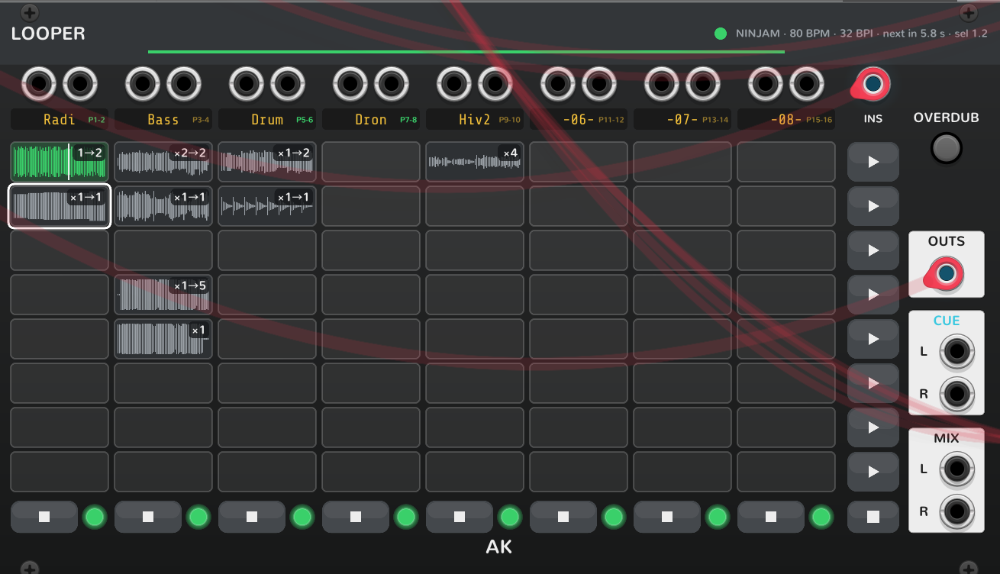

# AK Audio — Manual

The long version. The [README](../README.md) is the overview; this is the
what-does-this-knob-do reference. None of these modules touch the network unless you
ask them to — see [Privacy](../README.md#privacy).

- [Radio](#radio) — internet radio into a patch.
- [Ninjam](#ninjam) — listen to, or play in, a NINJAM room.
- [Looper](#looper) — 8×8 beat-quantized looper on the jam's clock.
- [Recorder](#recorder) — record the jam; export it as an Ableton Live set.
- [Troubleshooting](#troubleshooting) — what the panel error messages mean.

---

## Radio

Give it a stream, it plays. The audio comes out through a built-in level control.

### Panel

| Control | What it does |
|---|---|
| **LEVEL** knob | Built-in VCA, VCV AUDIO taper, −∞ up to +12 dB. The ring around the knob shows the current gain. |
| **CV** input | Optional 0–10 V control over the level (scales the knob). |
| **▲ / ▼** stepper | Step through all stations (bundled + your own), deduplicated by URL. |
| **Station display** | Click to open the station picker (thumbnails; the current station has a green ring). |
| **L / R** outputs | Stereo out. |
| **LED** | Lit only when audio is actually decoding and flowing — not just "connected". |

### Playing a station

Click the station display and pick one, or step with ▲/▼. It connects and plays. The
station is saved with the patch and resumes when you load it again.

Stations are ordinary Rack **presets** — they're also under right-click → *Preset*,
and in the *Stations* submenu.

### Adding your own station

Right-click → paste a stream URL into **Add station from URL**. The module tries it
out in the background: makes sure audio actually flows (not just that the server
answered), asks radio-browser what the station is called, and fetches its icon. Then:

- plays and was identified → saved under *Your stations*;
- plays but nobody knows it → you get asked for a name, then it's saved;
- doesn't play → back to the previous station, with the reason shown on the panel.

It won't save junk and it won't save the same URL twice. Plain stream URLs and
`.pls`/`.m3u` playlists both work.

### Codecs

MP3, AAC, and HLS (`.m3u8`) work on every platform. macOS decodes AAC with the
system AudioToolbox; Windows and Linux bring their own decoder.

---

## Ninjam

A client for [NINJAM](https://www.cockos.com/ninjam/) online jams. Two ways to use it:

### LISTEN — hear a room, send nothing

Plays the room's public stream, just like Radio. No login, no handshake, and nothing
leaves your machine. Good for checking out what's going on.

### JOIN — play in the room

The real NINJAM protocol: connect, log in (anonymously), hear the live multi-user
mix, and transmit whatever is on the module's input jacks — encoded as
interval-aligned OGG-Vorbis and uploaded so the room hears you.

> **JOIN sends audio.** Only use it when you mean to be heard. Chat goes to the same
> server. LISTEN never sends anything.

### Room browser

The panel has a browser of public rooms (from ninbot's directory): search, scroll,
click a room to listen or join. A peak meter shows what's coming in. Nothing here
ever blocks on the network — it all runs on background threads.

### Panel

| Control | What it does |
|---|---|
| **IN** jacks | Your audio into the room (JOIN only). |
| **OUT** jacks | The room mix out. |
| **Room browser** | Search / list / pick public rooms; peak meter. |
| **Chat** | Send and receive room chat. |

Your last room is saved with the patch and rejoined on load — but it never starts
transmitting until you explicitly do. Server credentials and your display name are
**not** in the patch; they live in a private local file in your Rack user folder, so
a shared `.vcv` leaks nothing (see [Privacy](../README.md#privacy)).

---

## Looper

An 8×8 grid of loops — Ableton Session view for a NINJAM jam. Put it right next to a
**Ninjam** module (either side) and it locks onto the room's grid; on its own it runs
on a simulated clock (interval length in the context menu).

Two things to know, and the rest follows:

- **Actions land on beats.** A press queues (blinking outline) and commits on the
  next beat — mid-interval is fine. One queued action per track; the latest press
  wins.
- **Loops run free.** A launched loop cycles at its own recorded length and speed,
  wherever the grid goes afterwards.

### Panel

| Control | What it does |
|---|---|
| **INS** (poly) | Your instruments: channels 1/2 = track 1 L/R, 3/4 = track 2, … Best fed from a mixer's poly **insert send** (see [With a mixer](#with-a-mixer)); direct-outs work too (a MindMeld MixMaster maps 1:1). |
| Per-track jacks | Per-track stereo inputs, if you'd rather not use INS (a track prefers its own jacks when connected). |
| **Track label** | Click to rename (4 characters, like MixMaster). With a MixMaster feeding INS, names sync both ways automatically. |
| **Grid cells** | Empty: press, and recording starts on the next **beat** (what you play just *before* it folds into the loop's tail — pickups survive). Filled: press to launch on the next beat; press again while playing to stop. Recording: press to **finish** — the take commits on the next beat, at however many beats it is, and starts looping (a chain replays from its first cell); press again to keep recording instead. The waveform fills in live while recording. |
| **▶ scene** | Launch a whole row: filled cells play, empty cells stop their track. Latest scene press wins. |
| **■ / stop row** | Stop a track (or all); also throws away a recording in progress. |
| **OVERDUB** | Latch: the selected playing cell keeps layering until you let go of the latch. |
| **TX lamps** | Per-track on-air toggle: green = in the MIX (the room hears it), cyan = private — the live input goes to CUE instead. |
| **OUTS / CUE / MIX** | Per-track poly out, private monitor out, and the stereo submix (cable MIX into Ninjam's IN to transmit it). |

### With a mixer

The way I wire it: the Looper as an **insert** on a MindMeld MixMaster (or any mixer
with poly insert points) — the mixer's insert send into **INS**, **OUTS** back into
the insert return. Each mixer channel then owns a looper track: live input passes
through while nothing loops, loops take over when launched, and the track names sync
with the mixer on their own.

Going to export the jam to **Ableton Live Lite**? Keep your instruments on tracks
**1–6**. The Lite export has to fit Live's 8-track cap, so it takes track 7 for the
bounced players and track 8 for your TX mix — takes sitting on grid tracks 7–8 get
dropped from the export (with a warning).

### Playing through the interval

A recording caps at one interval. Keep playing past the cap and it **auto-advances**
into the next empty cell, chaining downward until an interval comes in quiet — then
the whole chain is wired to replay in order from its first cell. Or end it yourself:
press the recording cell, and on the next beat the chain closes and starts cycling
from the top (a final chained bar with nothing played in it is dropped, so the loop
keeps its meter). Pressing any *other* cell throws the in-flight recording away, as
does ■.

### Tempo changes

A tempo change doesn't touch anything you already recorded: playing loops keep going
at their own speed — free-running against the new grid — and every take stays
launchable. Only queued presses and a recording in flight get cancelled.

### Persistence

Every committed take is saved as a raw OGG under the jam folder
(`~/Music/jams/<date>/<time>…/looper/`), and the grid comes back with the patch.
Takes can also embed in the `.vcv` itself (on by default, menu-toggleable), so a
shared patch carries its loops along.

---

## Recorder

Records the jam. Put it right next to a **Ninjam** module and arm **RECORD**: every
player's received intervals — and, with **REC TX** on, your own transmitted mix — are
written to disk as the raw OGG bytes. No re-encoding, nothing thrown away. Files land
under `~/Music/jams/<date>/<time>_<room>/`, with a JSON-lines index that places every
interval on the session timeline. The panel counts intervals per player while it
records.

Nothing is ever written, and nothing of the room is captured, unless the Recorder
sits armed next to a joined Ninjam — recording is always your explicit choice.

### Ableton Live export

When recording stops, the Recorder builds an **Ableton Live set** (`.als`) in the jam
folder — it opens directly in Live 11:

- the Looper grid as Session-view clips (looping, tempo-locked),
- what-played-when, reconstructed on each track's own Arrangement lane,
- every remote player and your TX mix as Arrangement tracks,
- tempo, loop brace, and bar positions set to match the jam.

From the context menu you can export any past jam folder, toggle the auto-export, and
pick the **Target Live edition**: *Standard/Suite* (a track per player) or *Lite*
(fits the 8-track cap: 6 loop tracks, all players merged onto one lane — overlapping
intervals get a proper audio mixdown — and your TX on the eighth).

---

## Troubleshooting

When a connection fails, the reason shows up where you're already looking — Radio
prints it in place of the station artwork, Ninjam in its status line. What the
messages mean:

| Message | What it means | What to try |
|---|---|---|
| **Cannot resolve host** | The name lookup (DNS) failed — the URL's hostname doesn't exist, or you're offline. | Check the URL for typos; check your connection / VPN. |
| **Connection refused** | The host answered — but nothing is listening on that port. Server down, or wrong port in the URL. | Try again later; check the port (NINJAM servers usually use 2049). |
| **Connection timed out** | The name resolved, but the connection got no answer at all — the packets just vanished. If the same station or room works elsewhere, something *on your machine or network* is dropping this app's traffic. | See [Works standalone, not in your DAW](#works-in-standalone-rack-but-not-inside-your-daw). |
| **Network unreachable** | Your machine has no route to the host — usually the network or a VPN just dropped. | Check your connection / VPN. |
| **HTTP: …** | The server answered but said no (e.g. a 404 — the stream mount is gone). | The station probably moved; find its current stream URL. |

### Works in standalone Rack, but not inside your DAW

The tell-tale: a station or room that plays fine in standalone Rack shows
**Connection timed out** when Rack runs as a plugin inside your DAW (Ableton Live,
Bitwig, …).

Firewalls grant network access **per application**. Standalone, the connection comes
from Rack's own executable — which you (or a prompt you clicked long ago) allowed. As
a plugin, the very same connection comes from **your DAW's process**, which may never
have been granted access, so the firewall silently drops it. DNS still works (lookups
go through a system service), which is why the name resolves and *then* the
connection times out.

The usual culprit is a third-party "internet security" suite (Norton, Avast, McAfee,
Kaspersky, …) — many block programs they don't recognize without showing any prompt.
Open its firewall / network-protection settings and **allow your DAW's executable**
(e.g. `Ableton Live 12 Suite.exe`), then retry. If you don't run one of those, check
the operating system's own firewall for a per-app rule the same way.

### The log file

akaudio logs every network failure — with the reason and timings — into Rack's log:
`log.txt` in the Rack user folder (Rack menu → *Help* → *Open user folder*), on lines
prefixed `akaudio.net:`. The healthy path is silent, so a quiet log means a healthy
plugin — whatever *is* there is worth reading, and worth pasting into a bug report.
